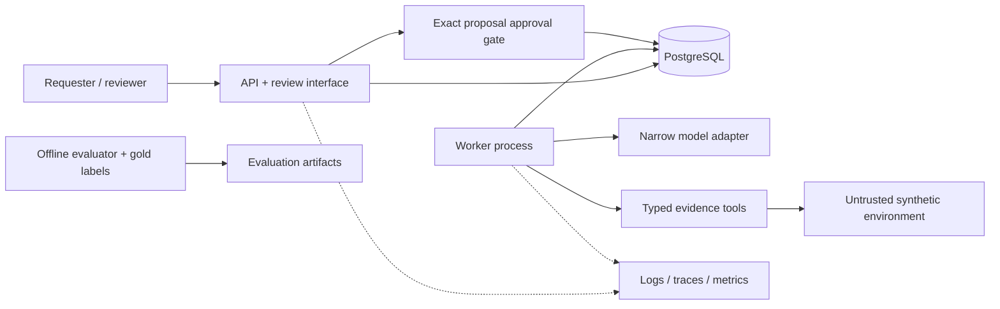

# Architecture

## Implemented in F1-01

One Python 3.12 package exposes a FastAPI application factory and
`GET /health/live`, returning the typed response `{"status":"ok"}`. Settings are
validated with pydantic-settings. The API starts without a database or model key.
No readiness claim is made. Tests, static checks, container configuration, and CI
form the foundation; the capabilities below are planned, not implemented.

## Implemented in F1-02 (PostgreSQL execution pending)

The persistence package defines runs, jobs, and run_steps using SQLAlchemy 2,
psycopg 3, and PostgreSQL JSONB. The initial Alembic revision creates named status
and nonnegative-counter constraints, one job per run, and unique step numbers per
run. UUID tenant IDs are required data, not proof of authenticated tenancy. Foreign
keys restrict deletion of referenced runs; there are no cascade relationships.

The run index `(tenant_id, created_at, id)` prepares tenant listing with stable
ordering; primary keys serve individual run lookup. It does not enforce tenant
isolation. A partial queued-job index `(next_attempt_at, id) WHERE status='queued'`
prepares due-job selection; no claiming logic exists. The job run uniqueness and
step `(run_id, step_no)` uniqueness also support loading a run's job and steps.
Other fields are deliberately not indexed without a query requirement.

An explicit engine scope owns pool disposal, and each synchronous transaction
helper commits or rolls back and closes its session. No connection opens on import,
no migration runs on startup, and the HTTP app still has no database dependency.
Future async handlers must offload blocking work rather than run it on the event
loop. Timestamps use TIMESTAMPTZ; initial values come from PostgreSQL. ORM updates
maintain updated_at; direct SQL callers must do so explicitly. State versions and
lease fields only prepare later recovery work. See [ADR 0002](adr/0002-synchronous-persistence.md).

There is still no readiness endpoint. F1-02 intentionally implements persistence
only; database-aware API lifecycle/readiness will be added when an API operation
uses the database. Real PostgreSQL execution remains blocked locally; integration
CI is configured but has not run. Offline checks are not database evidence.

## Planned boundaries

The API and worker will be separate process roles in one modular application.
Domain rules will remain independent of HTTP, SQLAlchemy persistence, and provider
adapters. PostgreSQL will be the durable source of truth for tenant-scoped runs,
jobs, steps, immutable proposals, approvals, local tickets, and audit records.
SQLAlchemy 2 synchronous persistence and Alembic are now implemented in F1-02;
the remaining tables and end-to-end guarantees below are future work.

The API will authenticate callers, derive tenant context, authorize every operation,
and create idempotent runs. The worker will claim PostgreSQL jobs with bounded
leases and fencing tokens, persist step progress, and resume after failure. No
transaction will remain open during a model call. Cancellation, deadlines, retries,
and tool/model budgets will be explicit and bounded.

A narrow typed model adapter will support a deterministic scripted fake by default
and a real provider later. Model output must pass schema and evidence-reference
validation; insufficient evidence must permit abstention. Four typed tools will
read metrics, logs, deployments, and runbooks. Their inputs, outputs, authorization,
and timeouts will be explicit. No arbitrary shell, SQL, or URL-fetching tool is
planned. Synthetic evidence is untrusted data, never an instruction source.

The reviewer will see an immutable proposal and approve its exact hash/version.
The server will enforce approval and authorization before applying a local ticket
effect, with its audit record, in a single PostgreSQL transaction. Model text cannot
authorize an action. A small Jinja2/HTMX interface will later expose this flow.

Structured logs, traces, metrics, and usage accounting will instrument boundaries
without becoming the source of truth. Secrets and sensitive evidence must not leak
into telemetry. Runtime fixtures and offline gold evaluation labels will have
separate access boundaries. Evaluations will publish reproducible artifacts rather
than invented measurements.

## Required future invariants (none implemented yet)

- The same tenant, idempotency key, and input resolve to the same run.
- Reusing an idempotency key with different input produces a conflict.
- An expired worker cannot commit progress after a newer lease takes ownership.
- Approval binds to an immutable proposal hash/version, not editable text or a run alone.
- Tenant identity comes from authenticated context, never a caller-controlled body field.
- Local ticket effects and audit records commit atomically.
- Gold evaluation labels are inaccessible to the runtime.
- Missing usage or cost is unknown, never silently zero.

Real PostgreSQL tests must establish locking and transaction properties; SQLite or
mocked repositories cannot demonstrate those guarantees. Default tests must remain
offline and must not call paid APIs. See the [ADR](adr/0001-initial-architecture.md)
for the scope decisions and [roadmap](../ROADMAP.md) for delivery order.
