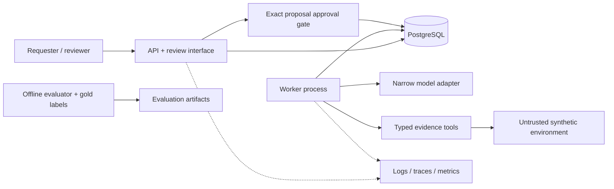

# Architecture

## Implemented in F1-01

One Python 3.12 package exposes a FastAPI application factory and
`GET /health/live`, returning the typed response `{"status":"ok"}`. Settings are
validated with pydantic-settings. The API starts without a database or model key.
No readiness claim is made. Tests, static checks, container configuration, and CI
form the foundation. Subsequent implemented milestones and future boundaries are separated below.

## Implemented in F1-02 (accepted by owner)

The persistence package defines runs, jobs, and run_steps using SQLAlchemy 2,
psycopg 3, and PostgreSQL JSONB. The initial Alembic revision creates named status
and nonnegative-counter constraints, one job per run, and unique step numbers per
run. UUID tenant IDs are required data, not proof of authenticated tenancy. Foreign
keys restrict deletion of referenced runs; there are no cascade relationships.

The run index `(tenant_id, created_at, id)` prepares tenant listing with stable
ordering; primary keys serve individual run lookup. It does not enforce tenant
isolation. A partial queued-job index `(next_attempt_at, id) WHERE status='queued'`
supports due-job selection; F1-04 implements claiming. The job run uniqueness and
step `(run_id, step_no)` uniqueness also support loading a run's job and steps.
Other fields are deliberately not indexed without a query requirement.

An explicit engine scope owns pool disposal, and each synchronous transaction
helper commits or rolls back and closes its session. No connection opens on import,
no migration runs on startup, and liveness has no database dependency.
Future async handlers must offload blocking work rather than run it on the event
loop. Timestamps use TIMESTAMPTZ; initial values come from PostgreSQL. ORM updates
maintain updated_at; direct SQL callers must do so explicitly. F1-04 now uses state versions and
lease fields for fenced lifecycle transitions. See [ADR 0002](adr/0002-synchronous-persistence.md).

There is still no readiness endpoint. F1-02 implemented persistence only;
F1-03 adds database-aware API lifecycle ownership for the run endpoints. All 16 integration cases pass on local PostgreSQL 17.11,
including real migration round-trips and transaction rollback. Hosted integration
CI is not verified by this local run.

## Implemented in F1-03

Tenant and API-key tables now back synchronous bearer authentication. The local
provisioning CLI generates keys; only their SHA-256 digests are stored. POST
/v1/runs validates identifiers, derives tenant identity from the key, and inserts
a run/job pair atomically. PostgreSQL uniqueness on tenant/idempotency key and an
INSERT ON CONFLICT path serialize competing creates. GET selects by run and tenant.
Replays return current persisted state; mismatched input conflicts. F1-04 adds
worker execution and fixture lookup. [ADR 0003](adr/0003-tenant-run-api.md) describes
migration backfill, transaction ownership, and the concurrency assumptions.

## Planned boundaries

The API and worker are separate process roles in one modular application.
Domain rules will remain independent of HTTP, SQLAlchemy persistence, and provider
adapters. PostgreSQL will be the durable source of truth for tenant-scoped runs,
jobs, steps, immutable proposals, approvals, local tickets, and audit records.
SQLAlchemy 2 synchronous persistence and Alembic are now implemented in F1-02;
the remaining tables and end-to-end guarantees below are future work.

The run API now authenticates callers, derives tenant context, and authorizes
idempotent creation and reads. The worker now claims PostgreSQL jobs with bounded
leases and fencing tokens and publishes deterministic fixture results. No
transaction will remain open during a model call. Worker retries are now bounded;
cancellation, provider deadlines and tool/model budgets remain future work.

A narrow typed model adapter will support a deterministic scripted fake by default
and a real provider later. Model output must pass schema and evidence-reference
validation; insufficient evidence must permit abstention. Four typed tools will
read metrics, logs, deployments, and runbooks. Their inputs, outputs, authorization,
and timeouts will be explicit. No arbitrary shell, SQL, or URL-fetching tool is
planned. Synthetic evidence is untrusted data, never an instruction source.

The reviewer will see an immutable proposal and approve its exact hash/version.
The server will enforce approval and authorization before applying a local ticket
effect, with its audit record, in a single PostgreSQL transaction. Model text cannot
authorize an action. A small Jinja2/HTMX interface will later expose this flow.

Structured logs, traces, metrics, and usage accounting will instrument boundaries
without becoming the source of truth. Secrets and sensitive evidence must not leak
into telemetry. Runtime fixtures and offline gold evaluation labels will have
separate access boundaries. Evaluations will publish reproducible artifacts rather
than invented measurements.

## Invariants and implementation status

- Implemented in F1-03: the same tenant, idempotency key, and input resolve to the same run.
- Implemented in F1-03: reusing an idempotency key with different input produces a conflict.
- Implemented in F1-04: an expired worker cannot publish after a newer lease takes ownership.
- Future: approval binds to an immutable proposal hash/version, not editable text or a run alone.
- Implemented in F1-03: tenant identity comes from authenticated context, never a caller-controlled body field.
- Future: local ticket effects and audit records commit atomically.
- Future: gold evaluation labels are inaccessible to the runtime.
- Future: missing usage or cost is unknown, never silently zero.

Real PostgreSQL tests must establish locking and transaction properties; SQLite or
mocked repositories cannot demonstrate those guarantees. Default tests must remain
offline and must not call paid APIs. See the [ADR](adr/0001-initial-architecture.md)
for the scope decisions and [roadmap](../ROADMAP.md) for delivery order.

## Implemented in F1-04

The separate `python -m incident_desk.worker` role claims PostgreSQL jobs with row
locks and SKIP LOCKED, bounded leases, generation fencing, and scheduled retries.
It executes a small packaged synthetic fixture outside transactions and atomically
publishes steps and terminal state. Success uses the existing `completed` status.
No provider calls or autonomous tools are involved. A failed or interrupted attempt
can repeat computation; fenced publication prevents duplicate successful results.
A summary is stored in the final completed RunStep, with no public result API yet.
JSON worker logs are implemented; metrics, tracing and usage accounting remain future.
See [ADR 0004](adr/0004-worker-lifecycle.md) for states, limits and recovery semantics.
